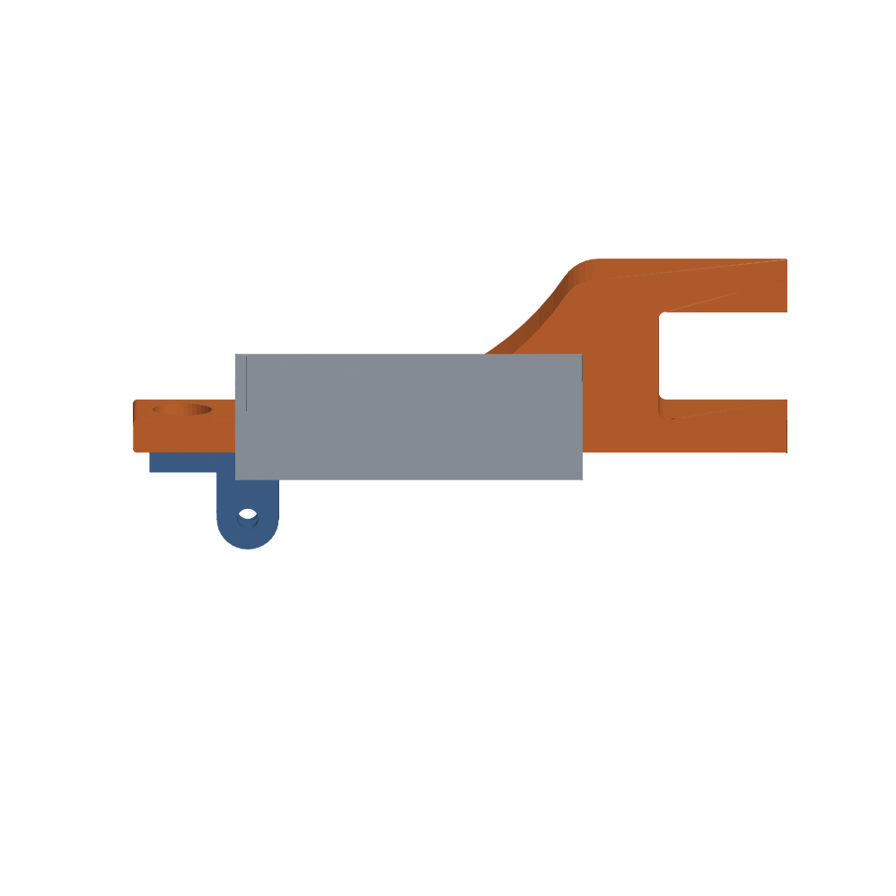

# Kamerahalterung v2: Spaghetti-Wächter am 3D-Drucker

Zweite Generation der Halterung für den KI-Druckwächter auf dem Arduino UNO Q
(Artikelserie auf [raspberry.tips](https://raspberry.tips/category/arduino)).
Die v1-Klammer saß am Gehäuse und ließ sich zu leicht verschieben — und
verschiebt man die Kamera, ist das Anomalie-Modell wertlos, weil es die Szene
mitgelernt hat. Deshalb v2: ein steifer Arm, der an der **Z-Säule** klemmt,
mit aufsteckbarer Wanne für das Board und einem Kamera-Adapter, der sich
horizontal und vertikal ausrichten lässt.

## Die Teile

| Datei | Teil | Maße | Druck-Hinweis |
|---|---|---|---|
| `stl/halterung-arm.stl` | Klemmarm: Maul 27,3 × 31,4 mm, dazu zwei Ø-3,3-Schraubkanäle (28 mm tief) in den Backen | 160 × 43,3 × 24 mm | flach aufs Bett (Profil unten), **kein Support**, 4–5 Wandlinien |
| `stl/uno-q-wanne.stl` | Wanne fürs Board, wird seitlich aufgesteckt | 85 × 94 × 16,5 mm | Boden aufs Bett, **Support nötig** — die zwei Haltezapfen ragen waagerecht ab |
| `stl/kamera-adapter.stl` | Pan/Tilt-Adapter für das Kameragehäuse | 36 × 24 × 25,5 mm | Platte aufs Bett, kein Support |

**Support für die Wanne:** Nur die beiden Zapfen an der Rückwand schweben
(Achse waagerecht, 3,8 mm über dem Bett). Im Slicer „Support: überall" mit
Standard-Schwellenwinkel genügt — es entsteht nur an diesen zwei Stellen
welcher und lässt sich mit den Fingern abbrechen.

⚠️ **Passung Wanne:** Im Testdruck saß das UNO Q etwas stramm — es geht, aber
ohne Luft. Wer lieber Spiel hat, öffnet `build_freecad.py` und erhöht `WL_`
(80) und `WB_` (65) im Abschnitt „Masse" um 0,5–1 mm, dann `build_freecad.py`
und `export_stl.py` neu laufen lassen. Die hier abgelegten STLs sind der Stand,
der real montiert ist.

## Zusammenbau

1. Arm mit dem Maul (27,3 mm Weite) auf die Z-Strebe schieben und mit **zwei
   Schrauben** sichern — sie kommen von der Stirnseite in die beiden
   Ø-3,3-Kanäle, je einer in der oberen und der unteren Klemmbacke. Im
   Testaufbau waren das schlichte Holzschrauben, die sich ihr Gewinde im PLA
   selbst schneiden: hält gut, ist aber nur begrenzt oft lösbar. Wer welche
   zur Hand hat, nimmt besser **M3-Gewindeeinsätze** zum Einschmelzen.
2. Wanne von der Seite auf die zwei Zapfen-Löcher (Ø 4,3 mm) stecken — die
   Zunge legt sich dabei bündig unter den Balken und stützt die Wanne.
3. Kamera-Adapter oben auf den Balken setzen und von oben verschrauben.
   **Beide Löcher sind Ø 6,6 mm Durchgang, kein Gewinde** — es braucht also
   eine ganz normale Schraube (M6 oder 1/4 Zoll passen beide) **mit Mutter**;
   die kommt von unten in die Senkung Ø 14,5 × 4 mm an der Balken-Unterseite
   und sitzt dort verdrehsicher (Sechskant bis SW 12,5 mm). Klemmpaket:
   5 mm Adapterplatte + 4 mm Restbalken = 9 mm.
   Lösen, drehen, wieder anziehen = Schwenk (Pan).
4. Kameragehäuse mit **M5-Schraube + Mutter** in die Gabel des Adapters —
   das ist die Neigung (Tilt). Beides Reibschluss, kein Rastwerk.

Kaufteile: 2 × Holzschraube ca. 3,5 mm (oder 2 × M3-Gewindeeinsatz + Schraube)
für die Z-Strebe, 1 × M6 bzw. 1/4" um 16 mm mit Mutter, 1 × M5 × 25 mit
Mutter. Alles gewöhnliche Metallschrauben — im Modell steckt bewusst kein
gedrucktes Gewinde. Kameragehäuse (`cam_back.stl` / `cam_front.stl`) liegt
unverändert in [`../kamera-halterung/`](../kamera-halterung/).

## Quellen bearbeiten

Alles ist parametrisch in FreeCAD 1.1 gebaut — die Maße stehen in einem
Tabellenblatt „Parameter" im Dokument:

| Datei | Zweck | Aufruf |
|---|---|---|
| `Halterung-v2.FCStd` | das Modell, alle drei Körper in Drucklage | in FreeCAD öffnen |
| `build_freecad.py` | baut das Dokument von Null neu | `freecadcmd build_freecad.py` |
| `export_stl.py` | exportiert die drei Körper nach `stl/` | `freecadcmd export_stl.py` |
| `render_stl.py` | erzeugt die Bilder in `renderings/` | `python render_stl.py` (braucht `trimesh` + `matplotlib`, **kein** FreeCAD) |

Die beiden FreeCAD-Scripts laufen headless, brauchen also keine Oberfläche.
Wer lieber klickt: Doppelklick auf eine Skizze im Baum zeigt alle Bemaßungen.

## Lizenz

CC BY 4.0 — raspberry.tips
